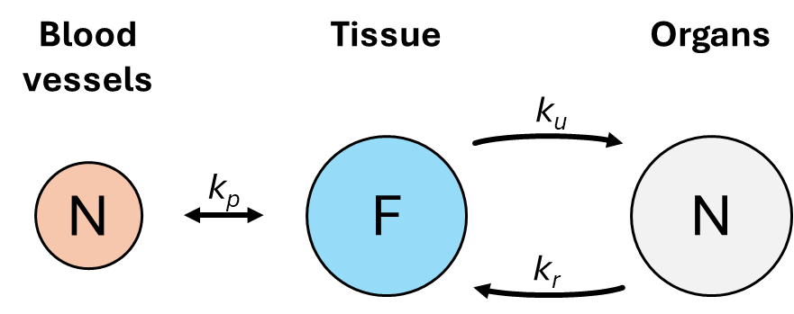

Tumor growth under drug treatment
=================================

This example presents a simple model of tumor growth coupled with the administration of an antitumor drug. The original research and the modeling methodology are detailed in :ref:`Drexler et al. (2020) <ref_drexler2020>`.

Background
----------

The original paper's experiments investigate the response of a murine breast cancer model to pegylated liposomal doxorubicin (PLD or Doxil) over a long time frame (approximately 80 to 250 days). The authors proposed a system of ordinary differential equations (ODEs) to describe the dynamics of tumor cells, necrotic cells, and drug levels in both the tumor tissue (central compartment) and peripheral organs (peripheral compartment). The drug treatment is modeled by instant changes to the drug levels in the central compartment at specific time points, corresponding to the actual injections administered in the in vivo experiment.

The equations of the mathematical model are as follows.

.. math::

    \begin{align*}
	\dot{x}_1 &= (a - n) x_1 - b \frac{x_1 x_3}{ED_{50} + x_3} \\
	\dot{x}_2 &= n x_1 + b \frac{x_1 x_3}{ED_{50} + x_3} - w x_2 \\
	\dot{x}_3 &= -(c + k_1) x_3 + k_2 x_4 - b_k \frac{x_1 x_3}{ED_{50} + x_3} \\
	\dot{x}_4 &= k_1 x_3 - k_2 x_4
    \end{align*}

Here, the state variables :math:`x_1` and :math:`x_2` represent the tumor tissue volume and the necrotic tissue volume (in mm\ :sup:`3` ). Variables :math:`x_3` and :math:`x_4` correspond to the drug levels (in mg/kg) in the central and peripheral compartments, respectively.

The model incorporates the following dynamics:

* Tumor cells proliferate at a known duplication rate (:math:`a`).
* Tumor cells undergo spontaneous necrosis at a rate (:math:`n`) independent of the drug level.
* Tumor cells convert into necrotic cells based on the drug level (:math:`x_3`) and the drug's specific properties (explained below).
* Necrotic cells are removed from the tissue (washout) at a known rate (:math:`w`).
* The drug is administered instantaneously, resulting in an immediate change to the level of :math:`x_3`.
* The drug is distributed between the two compartments, with transport governed by rates :math:`k_1` (central to peripheral) and :math:`k_2` (peripheral to central).

:numref:`figure1` shows a representative in vivo experimental result. The red dots represent the measured data series obtained by regularly monitoring the size (volume) of the tumor tissue implanted in the mouse.

By appropriately selecting the model parameters (fitting the model) and accounting for the treatment effects, this ODE model approximates the observed dynamics in reality: the rapidly growing tumor without treatment, followed by the volume decrease due to the treatment, which is explained by the death and clearance of the tumor tissue cells. After treatment, the drug is continuously cleared, thus its effect diminishes, leading to tumor regrowth.

.. _figure1:
.. figure:: Figure_1.png

    Actual tumor volumes measured during an experiment (red dots) and the simulated volumes obtained after fitting the model (blue line). The times of drug treatments are indicated by black arrows. (Re-plotted from data in :ref:`Drexler et al. (2020) <ref_drexler2020>`.)

LattiCS implementation
----------------------

The presented experiment will be implemented in LattiCS in two distinct forms: first, using a homogeneous simulation space similar to the ODE model (which allows for fast simulation runs and can serve as a surrogate model for parameter estimation), and subsequently, using a three-dimensional simulation space.

Following the selection of the simulation space, the model setup will proceed in two major steps: first, tuning the parameters of the drug introduced during the treatments, and subsequently, adding the agents that describe the tumor tissue cells to the model.

Initial steps
^^^^^^^^^^^^^

First, we load the ``lattics`` package and create a ``Simulation`` object and a ``HomogeneousSpace`` object. We use a 1-hour time step for the agents' simulation and a 5-second time step for the substrate (drug) simulation.

For practical reasons, the volume of the simulation space is set to 2.7 × 10\ :sup:`7` μm\ :sup:`3` (corresponding to a virtual cubic space of 300 μm × 300 μm × 300 μm). This choice primarily determines the maximum cell capacity, thus influencing the simulation speed. Given the agent volumes (see below), this space will accommodate a maximum of 8000 agents, a simulation that should take no more than a few minutes on an average personal computer.

.. code-block:: python

	import lattics

	simulation = lattics.Simulation()
	space = lattics.HomogeneousSpace(
		simulation=simulation,
		dt_agent=(1, 'hour'),
		dt_substrate=(5, 'sec'),
		volume=2.7 * 10 ** 7
		)
	simulation.add_space(space)

The pharmacokinetics of the drug
^^^^^^^^^^^^^^^^^^^^^^^^^^^^^^^^

In the animal experiments, the drug is administered to the subjects as a bolus injection, which causes its concentration in the blood to instantaneously increase, followed by distribution into the tissues and subsequent elimination (or degradation) over time. The ODE model describes the drug concentration within two compartments (tumor tissue and organs). This two-compartment approach allows the model to more accurately describe the measurable concentrations observed in vivo following treatment.

We now incorporate a substrate named "drug" into the simulation space. When creating the substrate, we must specify the diffusion coefficient and the decay coefficient describing spontaneous degradation of the substrate. Although diffusion will not be simulated in the homogeneous space, the diffusion coefficient can still be set here and will be required during the three-dimensional simulation. Based on literature data regarding the typical size of PLD nanoparticles (on the order of 100 nm), we will set the substrate's diffusion coefficient to 2 × 10\ :sup:`-3` μm\ :sup:`2`/ms (:ref:`Lee et al. (2021) <ref_lee2021>` and :ref:`Schleyer et al. (2024) <ref_schleyer2024>`). Since the decay rate will be determined experimentally (see below), we will set it to an arbitrary placeholder value (e.g., 0.0) for now.

.. code-block:: python

	space.add_substrate(
		name='drug',
		diffusion_coefficient=2e-3,
		decay_coefficient=0.0
		)

In our approach, the simulation space represents the tissue surrounding the tumor, into which the drug is delivered by the blood vessels running through it. In this context, the blood vessels are considered the sources of the drug; locations where the drug concentration increases following treatment, and from which the drug subsequently diffuses to other parts of the tissue. In LattiCS, these sources can be represented by ``SubstrateNode`` objects, for which we can specify the internal drug concentration and the characteristics of transport (uptake-release) with the surrounding environment.

Since the location, shape, and distribution of the vessels cannot be accounted for in a homogeneous space, we will now create a single ``SubstrateNode`` object to represent all blood vessels within the tissue. Based on literature data, the typical blood volume fraction in tissues is 5-15% (:ref:`Claridge et al. (2007) <ref_claridge2007>` and :ref:`Qi et al. (2008) <ref_qi2008>`). Accordingly, we will select 10% of the previously created space volume as the virtual volume for this ``SubstrateNode``.

.. code-block:: python

	blood_vessels = lattics.SubstrateNode()
	blood_vessels.set_attribute('volume', 2.7 * 10 ** 6)
	
When modeling the transport from the node to the surrounding tissue (space), three types of parameters can be specified to describe the process. For simplicity, we model this process by assuming that the drug moves between the vessels and the tissue at a rate proportional to the concentration difference; therefore, we will only set the parameter for the passive transport rate for the ``SubstrateNode`` (the other values will remain zero).

We hypothesize that this process occurs relatively quickly, so we set the rate value to a high value (10\ :sup:`-3` 1/ms), and the initial drug concentration to zero, which will increase as a result of the treatments.
	
.. code-block:: python
	
	blood_vessel_transport_info = lattics.SubstrateInfo(
		type='flux',
		concentration=0.0,
		passive_rate=1e-3
		)
	blood_vessels.get_attribute('substrate_info')['drug'] = blood_vessel_transport_info
	space._substrates['drug'].add_static_substrate_node(blood_vessels)

To account for the organs acting as a drug reservoir ("buffering effect") the ODE model introduces a second compartment. We model this using a second ``SubstrateNode`` object, where the initial concentration is also zero, and which changes due to bi-directional transfer with the simulation space. For simplicity, we set its virtual volume to be equal to that of the original simulation space (however, this has no direct role, as the same dynamic can be achieved with a node of different virtual volume by appropriately choosing the transport rate constants due to the form of the transport equations). The ``release_rate`` and ``uptake_rate`` map directly to the ODE model's :math:`k_1` and :math:`k_2` rate constants; however, they require subsequent fine-tuning (see below), and we set a placeholder value now.

.. code-block:: python

	organs = lattics.SubstrateNode()
	organs.set_attribute('volume', 2.7 * 10 ** 7)
	organs_transport_info = lattics.SubstrateInfo(
		type='flux',
		concentration=0.0,
		release_rate=1.0,
		uptake_rate=1.0
	)
	organs.get_attribute('substrate_info')['drug'] = organs_transport_info
	space._substrates['drug'].add_static_substrate_node(organs)

:numref:`figure2` summarizes the structure of the constructed pharmacokinetic model. The blue node represents the simulation space, which defines the drug concentration within the tissue, and is the environment from which the substrate (drug) enters the tumor cells. During treatment, the drug is introduced into the red node, which models the blood vessels, and is subsequently transferred to the tissue in a concentration-dependent manner. The gray node models the buffering effect of the organs, with the substrate flow rates between this organ compartment and the tissue regulated by the :math:`k_u` and :math:`k_r` parameters.

.. _figure2:

	
	Schematic of the constructed pharmacokinetic model.

    
Tumor growth
^^^^^^^^^^^^

References
----------

.. _ref_drexler2020:

`Drexler et al. (2020)` Dániel András Drexler, Tamás Ferenci, András Füredi, Gergely Szakács, Levente Kovács, "Experimental data-driven tumor modeling for chemotherapy",
IFAC-PapersOnLine, Volume 53, Issue 2, 2020, Pages 16245-16250, ISSN 2405-8963; https://doi.org/10.1016/j.ifacol.2020.12.619

.. _ref_claridge2007:

`Claridge et al. (2007)` Ela Claridge, Džena Hidović-Rowe, Phillipe Taniere, Tariq Ismail, "Quantifying mucosal blood volume fraction from multispectral images of the colon", Proc. SPIE 6511, Medical Imaging 2007: Physiology, Function, and Structure from Medical Images, 65110C (29 March 2007); https://doi.org/10.1117/12.709559

.. _ref_qi2008:

`Qi et al. (2008)` Xiu-Ling Qi, Peter Burns, Juimiin Hong, Jeff Stainsby, Graham Wright, "Characterizing blood volume fraction (BVF) in a VX2 tumor", Magnetic Resonance Imaging, Volume 26, Issue 2, 2008, Pages 206-214, ISSN 0730-725X; https://doi.org/10.1016/j.mri.2007.05.010

.. _ref_lee2021:

`Lee et al. (2021)` Benjamin J. Lee, Yahya Cheema, Shahed Bader, Gregg A. Duncan, "Shaping nanoparticle diffusion through biological barriers to drug delivery", JCIS Open, Volume 4, 2021, 100025, ISSN 2666-934X; https://doi.org/10.1016/j.jciso.2021.100025

.. _ref_schleyer2024:

`Schleyer et al. (2024)` Genevieve Schleyer, Eann A. Patterson, and Judith M. Curran, "Label free tracking to quantify nanoparticle diffusion through biological media", Sci Rep 14, 18822 (2024); https://doi.org/10.1038/s41598-024-69506-0

