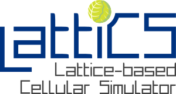

LattiCS Documentation
=====================

LattiCS (Lattice-based Cellular Simulator) is a flexible agent-based simulation framework designed to help you model the collective behavior of cellular systems and to support experimental biology. It's easy to use, even if you don't have advanced programming skills. With LattiCS, you can define and customize key biological properties for individual cell agents, such as cell cycle dynamics, cell-cell adhesion, motility, and phenotype changes. You can simulate the secretion, uptake, and transport of chemical substances, such as nutrients or drugs, and their effects on cells. Additionally, LattiCS makes it easy to define custom events, like treatments or other experiment-specific changes, during the simulation.

Contents
--------
.. toctree::
   :maxdepth: 2

   installation
   documentation
   tutorials
   about
