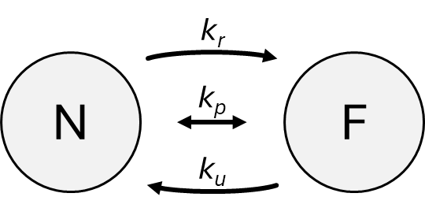

Cell–environment interactions and transport
===========================================

During a simulation, we may want to model the transport of chemical substances, such as nutrients, signaling factors, or drugs, that are taken up from or secreted into the environment by cells. This section explains the model used in LattiCS to simulate these processes.

Representation
--------------

Each chemical substance whose transport processes we want to simulate is represented by a SubstrateField object. This object is linked to the Space object that represents the simulation space, and it matches its dimensionality, size, and grid resolution (if these are applicable for the given space). The field object identifies the substance using a user-defined name (e.g., "oxygen" or "nutrient"). It continuously tracks the concentration and provides access to its values at any point in space.

Diffusion and decay
-------------------

The spatial and temporal behavior of the substance's concentration in a space without any sources or sinks is controlled by two key factors: the diffusion, and the decay of the substance. Diffusion is when a substance spreads out from where it's most concentrated to where it's less concentrated. Decay, on the other hand, is the substance's concentration naturally decreasing over time.

Diffusion
^^^^^^^^^

A substance's diffusion is determined by its diffusion coefficient. The greater this coefficient, the faster the substance's concentration spreads out. In LattiCS, diffusion is modeled by the diffusion or heat equation, a partial differential equation that describes how the concentration is distributed over time in a given area. The numerical solution for this equation is calculated using the locally one-dimensional (LOD) method described in [1]_. When the Space object doesn't have a real spatial structure, it means there are no distinct spatial divisions or locations to track. Therefore, instead of modeling how a substance spreads out, only a single, overall average concentration for the entire system is tracked.

Decay
^^^^^

A substance's decay is determined by its decay rate. The greater this rate, the faster the concentration decreases. In LattiCS, decay can be modeled in three ways:

* **First-order kinetics**: The decay rate is directly proportional to the substance's concentration, causing it to decrease exponentially.
* **Second-order kinetics**: The decay rate is proportional to the square of the concentration. As the concentration drops, the reaction slows down.
* **Michaelis--Menten kinetics**: Decay is mediated by a component that can become saturated, like an enzyme. At low concentrations, the rate is roughly proportional to the concentration (similar to first-order decay). At high concentrations, the rate becomes constant, independent of the concentration (zero-order decay).

For modeling decay with either first-order or second-order kinetics, the exact analytical solution is calculated during the simulation. However, since there is no analytical solution for Michaelis-Menten kinetics, an implicit numerical approximation is used instead. Note, that the numerical approximation can produce inaccurate results if large time steps are used during the simulation.

When a Space object has a spatial structure, the decay is computed separately at each grid point. In contrast, if there is no spatial structure, a single value is tracked for the decay, much like how a single average concentration is tracked for diffusion.

Release and uptake by nodes
---------------------------

The appearance and disappearance of a chemical substance within the field occur at specific points called *nodes*. Nodes are virtual locations within the field where the concentration of the substance is either fixed (fixed-type node) or changes over time based on predefined rates and current concentration values (flux-type node). A node may represent, for example, an agent (such as a cell), or an abstract point where the substance is introduced into the simulation space (e.g., a drug carrier particle).

Fixed-type nodes
^^^^^^^^^^^^^^^^

In the case of a fixed-type node, the concentration value of the field at the node's location is set to the `concentration` specified for the node. (If position is not applicable for the space, the field's concentration will be the average of the values specified by all fixed-type nodes.)

Flux-type nodes
^^^^^^^^^^^^^^^

In the case of a flux-type node, the concentration in the field at the node's location and the concentration within the node itself evolve according to the following model. Consider the node and the field as two separate compartments, denoted by *N* and *F*, respectively (see the figure below). *F* may represent either the entire field or just the chunk of the field corresponding to the node's position.

|

The following types of concentration exchange can be defined between the compartments:

* **Passive transport**: The concentrations in the two compartments change based on the difference between their concentrations and a rate constant. In the case of cells, gases, hydrophobic molecules, and small polar molecules typically cross the membrane via this mechanism. The rate of concentration change is governed by the coefficient :math:`k_p`. Due to passive transport, the concentrations of the two compartments gradually equalize over a sufficiently long time.

* **Active secretion**: the node releases a substance into the field. The change depends on the concentration :math:`c_N` in compartment *N*, and the rate constant :math:`k_r`. In the case of cells, this process can model the function of certain transporter proteins (e.g., ABC transporters), which are capable of pumping chemical substances from inside the cell even against a concentration gradient.

* **Active uptake**: the node takes up a substance from the field. The change depends on the concentration :math:`c_F` in compartment *F*, and the uptake rate constant :math:`k_u`. In cells, this process also models the activity of transporter proteins (e.g., glucose uptake), and it is typically significantly faster than passive transport. 

According to the principle of mass conservation and Fick's first law, the mass changes in the compartments can be described by the following differential equations.

.. math::

    \begin{align*}
    v_N \frac{\mathrm{d} c_N}{\mathrm{d} t} &= k_p \left( c_F - c_N \right) + k_u c_F - k_r c_N \\[0.5em]
    v_F \frac{\mathrm{d} c_F}{\mathrm{d} t} &= - k_p \left( c_F - c_N \right) - k_u c_F + k_r c_N \\
    \end{align*}

Here, :math:`c_N` and :math:`c_F` denote the time-dependent concentrations of the substance in the respective compartments, and :math:`k_p`, :math:`k_r`, and :math:`k_u` are the rate constants defined previously. Changes in a substance's concentration are directly linked to changes in its total amount (or mass), given the compartment volumes :math:`v_N` and :math:`v_F`.

After discretizing the variables, the backward Euler method (also known as the implicit Euler method) is used to approximate the solution of the equations. Note, that the numerical approximation can produce inaccurate results if large time steps are used during the simulation.

References
----------

.. [1] Ahmadreza Ghaffarizadeh, Samuel H. Friedman, Paul Macklin, BioFVM: an efficient, parallelized diffusive transport solver for 3-D biological simulations, Bioinformatics, Volume 32, Issue 8, April 2016, Pages 1256–1258, https://doi.org/10.1093/bioinformatics/btv730
